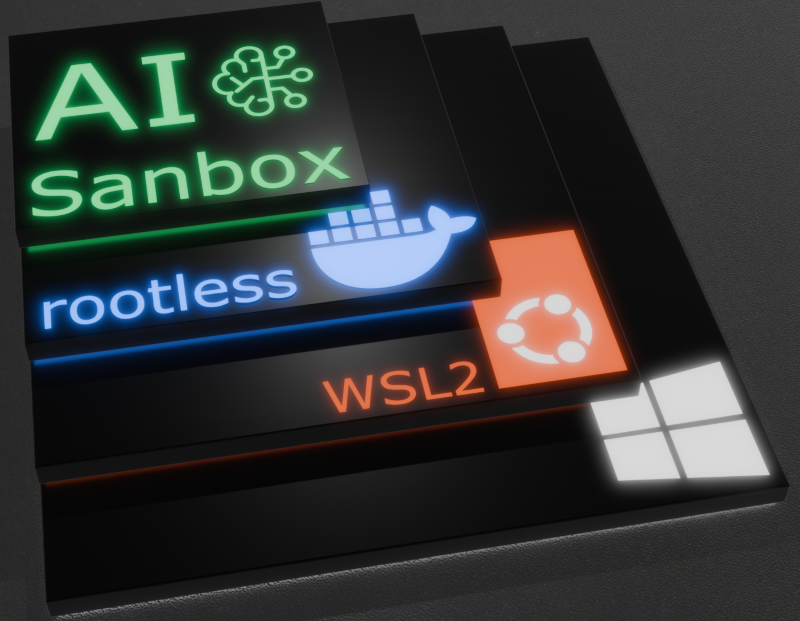

# Custom Windows AI Sandbox


Setup notes and scripts for my WSL2 Ubuntu 'AI Sandbox'. Work in progress; comments and testing welcome. See [Rootless Docker Guide](./rootless_docker_guide.md) for a comprehensive description of script functionality.

#### Windows OS &#8594; WSL2 Ubuntu 24.04 LTS &#8594; Rootless Docker &#8594; Custom AI Sandbox Containers

# General Information

This repository contains scripts and notes for configuring a secure, rootless Docker environment specifically on WSL2 running Ubuntu on Windows.

# Usage

* Inside WSL Ubuntu
* Clone this repo and `cd` into it
* Run `./setup-rootless-docker-wsl.sh`
  * This will setup rootless docker, and only needs to be run ONCE!
* Run `code .` and ensure Remote Development extension pack is installed <span style="color:red; font-weight:bold">IMPORTANT!</span> &#8594; Code must be run from inside WSL2 Ubuntu, not from Windows. Running from Windows can switch to rootful Docker if Docker installed in Windows OS.
* Add a .env file in repo workspace root and add git name and email.
``` bash
GIT_NAME="dave"
GIT_EMAIL="1234567+dave@users.noreply.github.com"
```
* Ctrl/CMD + Shift + P and select: `Dev Containers: Rebuild and Reopen in Container`
* Rootless docker should start as a dev container; see `devcontainer.json` for parameters.
    * `entrypoint.sh` will setup git global variables, and run a full ohmyzsh setup script.

## Insert Into Repo
* Once rootless docker setup inside WSL2 Ubuntu, copy and paste `.devcontainer` folder into any given repo, use `Dev Containers: Rebuild and Reopen in Container` and continue to develop in that sandbox.

## Next Steps
* Scripts and controls for saving AI Sanbox images once setup - currently need to wait for ohmyzsh to setup, and manual conda env setup for any given project


# Miscellaneous Notes

### Zsh & Oh-My-Zsh
* I love ohmyzsh and like to have it everywhere possible.  The `entrypoint.sh` will run a container ohmyzsh setup script.  The host equivalent is also useful, and will require a sudo password for installs and font cache refresh. Don't take my word for it; read the script to make sure !

### Issue - dbus persistence
* Issues with dbus and bus not being setup on reboots of WSL or Win OS appear to be a race condition between systemd and WSLg. D-Bus socket does not activate, and docker does not start properly.  A *kickstart* method has been implemented into .profile, together with a passwordless sudo for restarting the user service only.
  * docker.service file moved to permanent location in `/etc/systemd/user/`

### Modified Service File

~~Ensure the Docker service environment paths in `/home/[username]/.config/systemd/user/docker.service` are wrapped in quotes:~~

```ini
[Service]
Environment=PATH="/usr ... "
```

**UPDATED** The path issue is now handled by the setup script. If any problems persist, refer to the uninstall section below.

## Uninstalling Rootless Docker

To reset your environment, execute:

```bash
/usr/bin/dockerd-rootless-setuptool.sh uninstall -f; /usr/bin/rootlesskit rm -rf /home/"$(id -un)"/.local/share/docker
/usr/bin/rootlesskit rm -rf /home/"$(id -un)"/.local/share/docker
```

## Docker security and testing

### Docker Bench

Given that the docker bench is run rootless, there are a number of moot points - anybody feedback from those with time/interest in finding ways to harden this is truly appreciated.
```bash
git clone https://github.com/docker/docker-bench-security.git
cd docker-bench-security
# run docker bench in user to access user specific docker socket - sudo testing is not the idea here
docker-bench-security.sh
```
see `docker-bench-security-report.md`

# Resources

## CUDA
* See `Docker support`: https://docs.nvidia.com/cuda/wsl-user-guide/index.html#nvidia-compute-software-support-on-wsl-2
<!-- * Pre installation steps:  https://docs.nvidia.com/cuda/cuda-installation-guide-linux/#windows-subsystem-for-linux -->

