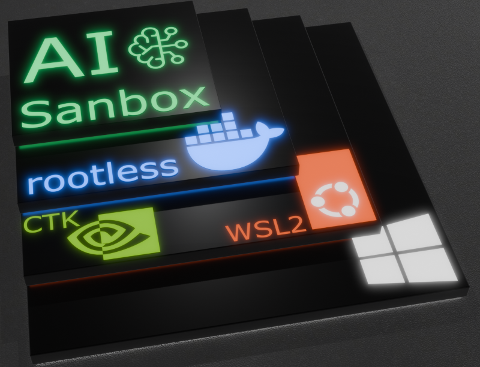
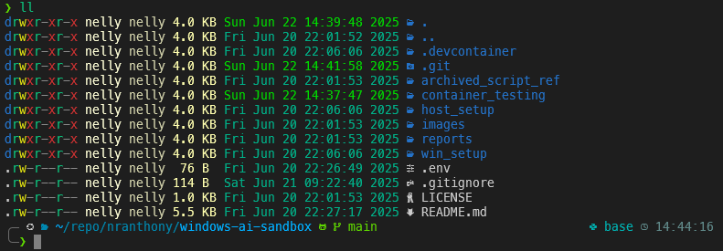

# Custom Windows AI Sandbox


Setup notes and scripts for my WSL2 Ubuntu 'AI Sandbox'. Work in progress; comments and testing welcome. See [Rootless Docker Guide](./rootless_docker_guide.md) for a comprehensive description of script functionality.

#### Windows OS &#8594; WSL2 Ubuntu 24.04 LTS &#8594; Rootless Docker &#8594; Custom AI Sandbox Containers

# General Information

This repository contains scripts and notes for configuring a secure, rootless Docker environment specifically on WSL2 running Ubuntu on Windows.

# Usage

* **Clone Repo**

* **In Windows:**
  * Copy `\win_setup\.wslconfig` to `C:\Users\<UserName>\.wslconfig`; this enables Windows/3rd Party firewall usage.

* **Inside WSL Ubuntu**
  * `cd` into `host_setup`
  * NOTE - **sudo** is required for these scripts for installs and modification of system files - PLEASE read scripts to convince yourself the scripts are not malicious.
  * Run `./setup-rootless-docker-wsl.sh`
    * This will setup rootless docker, and only needs to be run ONCE!
    * NOTE - if docker doesn't restart, it may have gotten stuck. Run `journalctl --user -u docker -n 50` and `systemctl --user status docker.service` to start the debug diagnostics.
  * Run `sudo ./wsl_conf_update.sh`
  * (Optional) Run `./ohmyzsh-host-setup.sh`
  * `exit` (twice if inside zsh), and in Powershell run `wsl --shutdown`
    * WAIT at least 8 seconds and reopen the WSL Ubuntu terminal
  * `cd` back in to repo, and run `code .` and ensure Remote Development extension pack is installed <span style="color:red; font-weight:bold">IMPORTANT!</span> &#8594; Code must be run from inside WSL2 Ubuntu, not from Windows. Running from Windows can switch to rootful Docker if Docker installed in Windows OS.
    * _Side Note_ - run `zsh` to use launch into oh-my-zsh with p10k settings.
  * Add a .env file in repo workspace root and add git name and email. Don't forget this part; the dev container will fail if these environment variables are not available. I typically have a .env file for this stored in C:\dev\git and drag and drop for ease.
  * ``` bash
    GIT_NAME="dave"
    GIT_EMAIL="1234567+dave@users.noreply.github.com"
    ```
  * Ctrl/CMD + Shift + P and select: `Dev Containers: Rebuild and Reopen in Container`
  * Rootless docker should start as a dev container; see `./.devcontainer/devcontainer.json` for parameters.
    * `./.devcontainer/entrypoint.sh` will setup git global variables, and run a full ohmyzsh setup script.
    * Typically need to hit any key and then kill that terminal in VSCode and open a fresh one.
    * Again, type `zsh` to use oh-my-zsh
  * **Inside Dev Container**
    * Testing GPU
      * Run `mamba env create -f ./container_testing/environment.yml`; _Installing pip packages: torch, torchvision_ can be slow ish - ~ 2 GB of packages - also pip inside conda/mamba env files are known to be slower - go make a cuppa and think about the world for a minute.
      * Open `./container_testing/cuda_test.ipynb`, and ensure Kernel is set to `myenv`.  **Run All** and you should see `CUDA available:  True` printed from the first cell.


      

## Insert Into New Repo
* Once rootless docker setup inside WSL2 Ubuntu, copy and paste `.devcontainer` folder into any given repo and modify as needed, use `Dev Containers: Rebuild and Reopen in Container` and continue to develop in that sandbox.

## Next Steps
* **Creating Container Images** - Scripts and controls for saving AI Sanbox images once setup complete - currently need to wait for ohmyzsh to setup, and manual conda env setup for any given project
* **Container Breakout Testing** - see, for example: https://unit42.paloaltonetworks.com/container-escape-techniques 
* **Conda Env Visibility** - sometimes only conda base is easy to access with vscode on first run - steps to dertermine why conda PATH entries are not included in vscode python/notebook extensions.

# Miscellaneous Notes

### Zsh & Oh-My-Zsh
* I love ohmyzsh and like to have it everywhere possible.  The `./.devcontainer/entrypoint.sh` will run a container ohmyzsh setup script.  The host equivalent is also useful, and will require a sudo password for installs and font cache refresh. Don't take my word for it; read the script to make sure !

### Issue - D-Bus persistence
* Issues with dbus and bus not being setup on reboots of WSL or Win OS appear to be a race condition between systemd and WSLg. D-Bus socket does not activate, and docker does not start properly.  A *kickstart* method has been implemented into .profile, together with a passwordless sudo for restarting the user service only.
  * docker.service file moved to permanent location in `/etc/systemd/user/`

### Modified Service File

~~Ensure the Docker service environment paths in `/home/[username]/.config/systemd/user/docker.service` are wrapped in quotes:~~

```ini
[Service]
Environment=PATH="/usr ... "
```

**UPDATED** The path issue is now handled by the setup script. If any problems persist, refer to the uninstall section below.

## VSCode Error Post Ubuntu Updates

Running frequent updates are advised, e.g.:
```sh 
sudo apt update && sudo apt upgrade && sudo reboot
```
This can lead to:  
`❯ code --version
/mnt/c/Program Files/Microsoft VS Code/bin/code: 61: /mnt/c/Program Files/Microsoft VS Code/Code.exe: Exec format error`

Exit Ubuntu and shutdown in Windows: `wsl --shutdown`  

## Uninstalling Rootless Docker

To reset your environment, execute:

```bash
/usr/bin/dockerd-rootless-setuptool.sh uninstall -f; /usr/bin/rootlesskit rm -rf /home/"$(id -un)"/.local/share/docker
/usr/bin/rootlesskit rm -rf /home/"$(id -un)"/.local/share/docker
```

## Docker security and testing

### Docker Bench

Given that the docker bench is run rootless, there are a number of moot points - anybody feedback from those with time/interest in finding ways to harden this is truly appreciated.
```bash
git clone https://github.com/docker/docker-bench-security.git
cd docker-bench-security
# run docker bench in user to access user specific docker socket - sudo testing is not the idea here
docker-bench-security.sh
```
see `./reports/docker-bench-security-report.md`

# Resources

## WSL
* Windows and WSL Ubuntu Host WSL docs: https://learn.microsoft.com/en-us/windows/wsl/wsl-config

## CUDA
* See `Docker support`: https://docs.nvidia.com/cuda/wsl-user-guide/index.html#nvidia-compute-software-support-on-wsl-2
<!-- * Pre installation steps:  https://docs.nvidia.com/cuda/cuda-installation-guide-linux/#windows-subsystem-for-linux -->

