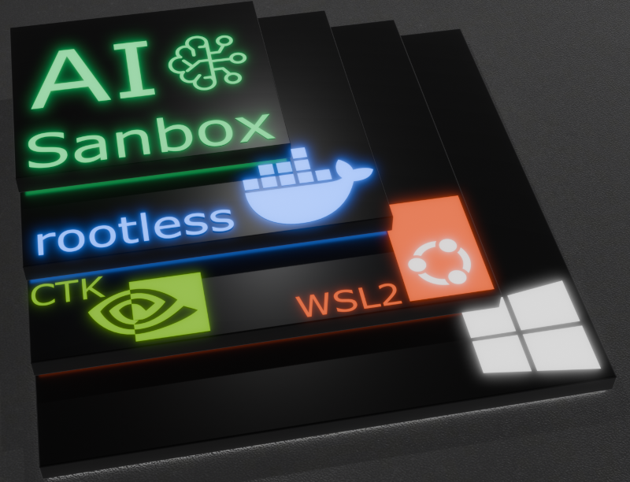
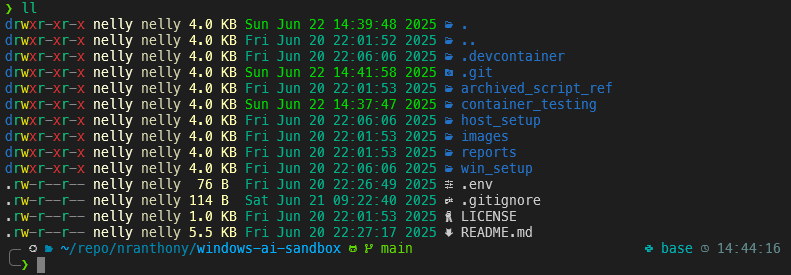

# Custom Windows AI Sandbox


WSL2 Ubuntu 24.04 + rootless Docker + NVIDIA CUDA, organized as a **profile-based sandbox**: one shared hardened image, many per-profile workspaces, Squid-gated egress. Adapted from the sibling [macolima](https://github.com/nranthony/macolima) project.

#### Windows OS &#8594; WSL2 Ubuntu 24.04 LTS &#8594; Rootless Docker &#8594; `windows-ai-sandbox:latest` (one per profile)

---

## Quick Start

```bash
# One-time host setup (see "Initial Setup" below)
cd host_setup && ./setup-rootless-docker-wsl.sh && sudo ./wsl_conf_update.sh

# Build the shared image
scripts/profile.sh build

# Bring up a profile (first profile = nranthony, workspace = ~/repo/nranthony/)
mkdir -p ~/repo/nranthony
scripts/profile.sh nranthony up
scripts/profile.sh nranthony auth           # claude login (one-time)
scripts/profile.sh nranthony auth-github    # optional
scripts/profile.sh nranthony attach         # zsh into the container
```

Day-to-day: `scripts/profile.sh <profile> {up,down,attach,logs,status,exec,clean}`. See `scripts/profile.sh list` for all profiles.

---

## What's inside

| Layer | Details |
|---|---|
| Base image | NVIDIA CUDA 12.6.3 on Ubuntu 24.04 (digest-pinned) |
| Tools baked in | Claude Code, GitHub CLI (`gh`), GitLab CLI (`glab`), `uv`, zsh + oh-my-zsh + powerlevel10k |
| Runtime hardening | `cap_drop: ALL`, `seccomp=./seccomp.json`, `no-new-privileges`, tmpfs noexec, `pids_limit:512`, `mem_limit:8g` |
| Network | `sandbox-internal` (internal:true) + Squid sidecar on `sandbox-external`; allowlist is the only way out |
| User | root-in-container (UID 0) — remaps to host UID 1000 under rootless Docker userns=host |
| GPU | `/dev/dxg` + `/usr/lib/wsl` bind + `LD_LIBRARY_PATH=/usr/lib/wsl/lib` (WSL2-native, not `--gpus all`) |
| Persistent state | `~/.ai-sandbox/profiles/<profile>/` — outlives container recreates |

**Not installed, by design** (see `sandbox-hardening-package.md` §7): `bubblewrap`, `socat`, `openssh-client`. These are the tools that would weaponize container escape or VS Code agent-forwarding leaks. See `scripts/verify-sandbox.sh` for the full tripwire.

---

## Initial Setup

### Windows side
1. Copy `win_setup/.wslconfig` → `C:\Users\<UserName>\.wslconfig` (enables Windows firewall integration).
2. Open WSL Ubuntu in a fresh terminal tab (not the one auto-launched by `pwsh` — it has known stdout quirks).

### WSL Ubuntu side
```bash
cd host_setup
./setup-rootless-docker-wsl.sh     # rootless Docker (sudo used internally — read first!)
sudo ./wsl_conf_update.sh          # /etc/wsl.conf
./ohmyzsh-host-setup.sh            # optional: host-side oh-my-zsh
exit                               # then `wsl --shutdown` in Powershell, wait 8s, reopen
```

### VS Code host settings (important — audit Findings A + B)
In Windows VS Code: `Ctrl+Shift+P` → **"Preferences: Open User Settings (JSON)"** (or edit `%APPDATA%\Code\User\settings.json` directly — from WSL that's `/mnt/c/Users/<user>/AppData/Roaming/Code/User/settings.json`). Add:
```jsonc
{
  "remote.SSH.enableAgentForwarding": false,
  "dev.containers.copyGitConfig": false
}
```
These prevent host SSH agent sockets and `~/.gitconfig` (including credential helpers) from leaking into the container. The image also purges `openssh-client` and `init-profile-state.sh` scrubs injected credential helpers on every `up`, as belt-and-braces.

### Repo root `.env`
```bash
GIT_NAME="your-name"
GIT_EMAIL="your-email@example.com"
PROFILE=nranthony
COMPOSE_PROJECT_NAME=ai-sandbox-nranthony
```
`GIT_NAME`/`GIT_EMAIL` are used by `scripts/setup.sh` to seed git identity. `PROFILE` and `COMPOSE_PROJECT_NAME` are required for VS Code "Reopen in Container" (see the VS Code section below). Update these when switching profiles. `scripts/profile.sh` always exports its own `PROFILE`/`COMPOSE_PROJECT_NAME`, so the `.env` values only affect VS Code.

---

## Profile Workflow

### Bring up a profile
```bash
mkdir -p ~/repo/<profile>                # workspace parent (holds one or more repos)
scripts/profile.sh <profile> up          # creates state dirs, brings up agent + egress-proxy
scripts/profile.sh <profile> auth        # claude login — one-time; token persists in ~/.ai-sandbox/
```

### Commands
| Command | Action |
|---|---|
| `up` | brings up stack + seeds state dirs |
| `down` | stops container (state preserved) |
| `attach` | zsh into the agent container |
| `auth` / `auth-github` / `auth-gitlab` | interactive logins |
| `logs` / `status` | compose logs / ps |
| `build` | rebuild shared image (all profiles pick up) |
| `rebuild` | build + recreate this profile |
| `reset-settings` | overwrite claude settings.json from template (backs up old) |
| `clean` [`--deep`] | prune rotating state (backups, paste-cache, MCP logs) |
| `list` | all profiles with up/down status |
| `exec <cmd>` | run arbitrary command inside the container |

### Per-profile state
```
~/.ai-sandbox/profiles/<profile>/
├── claude-home/       # claude sessions, settings, credentials, MCP
├── claude.json        # first-run state, oauthAccount
├── cache/             # npm, uv, pip caches
└── config/            # gh tokens, glab tokens, git config
```

### Inside the container
- `claude`, `gh`, `glab`, `uv`, `python3`, `node` pre-installed.
- `/workspace` = `~/repo/<profile>/` (many repos).
- `/root/.venv` (Python 3.12) — VS Code's default interpreter for smoke tests.
- Claude's `Bash` tool is restricted by `config/claude-settings.json` (pip/uv/git push/curl/ssh denied). The interactive zsh is NOT restricted — install deps yourself during planning, then hand off to the agent.

---

## VS Code

Two flows supported:
1. **Attach to Running Container** (simplest): `scripts/profile.sh <profile> up` first, then in VS Code: `Ctrl+Shift+P` → `Dev Containers: Attach to Running Container...` → `ai-sandbox-<profile>`.
2. **Reopen in Container** (uses devcontainer.json): bring up the profile first, then `code .` in this repo (or a per-repo copy), then `Ctrl+Shift+P` → `Dev Containers: Reopen in Container`.

**Reopen in Container prerequisites:**
1. The profile stack must already be running (`scripts/profile.sh <profile> up`).
2. The repo-root `.env` must contain `PROFILE` and `COMPOSE_PROJECT_NAME` matching the running profile:
   ```bash
   PROFILE=nranthony
   COMPOSE_PROJECT_NAME=ai-sandbox-nranthony
   ```
   **Why:** VS Code's Dev Containers extension does **not** pass shell-session `export`s (like `export PROFILE=...`) through to docker compose. Its `userEnvProbe` reads only the login shell environment. And without `COMPOSE_PROJECT_NAME`, VS Code derives the project name from the compose file's directory (`windows-ai-sandbox`), which collides with the running profile's network (`ai-sandbox-<profile>_sandbox-internal`) on the shared `172.30.0.0/24` subnet. `scripts/profile.sh` always exports its own values, so the `.env` only affects VS Code.

**Both flows attach to the same compose-hardened container** — the security posture is identical (seccomp, cap_drop, sandbox-internal, DNS sinkhole all live in `docker-compose.yml`). Reopen adds convenience guardrails on top: `remote.autoForwardPorts: false`, explicit `forwardPorts`, pinned Python interpreter, zsh terminal default. See [`docs/vscode-integration-security.md`](docs/vscode-integration-security.md#anatomy-what-lands-where) for the anatomy.

For other repos under `~/repo/<profile>/<repo>/`, copy `devcontainer-template/devcontainer.json` → `<repo>/.devcontainer/devcontainer.json`. Adjust the `dockerComposeFile` relative path to point to this repo's `docker-compose.yml` — the template assumes the sandbox is a sibling at `~/repo/<profile>/windows-ai-sandbox/`; if your sandbox lives elsewhere (e.g., `~/repo/sandbox/windows-ai-sandbox/`), update the path accordingly.

**Adding extensions:** edit the `customizations.vscode.extensions` array in whichever devcontainer.json applies (this repo's `.devcontainer/`, the per-repo one, or the template). Extensions install into `/root/.vscode-server/extensions/` on next attach — no image rebuild needed. For the Attach-to-Running flow (which ignores devcontainer.json), use `"dev.containers.defaultExtensions": [...]` in host user settings instead.

---

## Testing GPU/CUDA
```bash
scripts/profile.sh <profile> exec bash -lc '
  cd /workspace/windows-ai-sandbox/container_testing && uv sync && \
  uv run python -c "import torch; print(torch.cuda.is_available())"
'
# Expected: True
```
Or inside the attached container: `jupyter notebook container_testing/cuda_test.ipynb` — `CUDA available: True` in the first cell.

---

## Hardening Verification
```bash
scripts/profile.sh <profile> exec bash /workspace/windows-ai-sandbox/scripts/verify-sandbox.sh
```
Expected summary: direct internet blocked, `api.anthropic.com` reachable via proxy, `example.com` blocked, `CapEff=0`, `NoNewPrivs=1`, `Seccomp=2`, `bwrap/socat/ssh` absent, no leaked `/root/.gitconfig`, no `SSH_AUTH_SOCK`, no `credential.helper` injection.

## Image CVE Scan (trivy)
```bash
# On WSL host (see scripts/trivy-scan.sh header for install instructions)
scripts/trivy-scan.sh              # config + secret + image
scripts/trivy-scan.sh image        # CVE scan only
```
Accepted CVEs live in `.trivyignore.yaml`; each has an `expired_at` so it re-surfaces on re-scan.

---

## Troubleshooting

### Permission issues
See `.devcontainer/ROOTLESS-DOCKER-NOTES.md` — bind mount ownership, sudo blocked by `no-new-privileges`, CUDA version matching.

### Common
- **Docker not starting on WSL resume**: `systemctl --user restart docker.service`. D-Bus race is kickstarted from `.zprofile`/`.profile` by the host setup.
- **CUDA version mismatch**: container uses 12.6.3 (driver ≥530.30).
- **VS Code `Exec format error` after Ubuntu upgrade**: `wsl --shutdown` in Powershell, reopen.
- **`code .` from Windows opens rootful Docker**: always launch from inside WSL.

### Uninstall rootless Docker
```bash
/usr/bin/dockerd-rootless-setuptool.sh uninstall -f
/usr/bin/rootlesskit rm -rf "$HOME/.local/share/docker"
```

---

## Docker Security Audit

Docker Bench results under `./reports/docker-bench-security-report.md`. Many rootful-Docker findings don't apply here (rootless daemon, user-namespaced); feedback on further hardening welcome.
```bash
git clone https://github.com/docker/docker-bench-security.git
cd docker-bench-security && ./docker-bench-security.sh
```

---

## Resources
- WSL config: https://learn.microsoft.com/en-us/windows/wsl/wsl-config
- CUDA on WSL: https://docs.nvidia.com/cuda/wsl-user-guide/
- Container breakout reading: https://unit42.paloaltonetworks.com/container-escape-techniques


