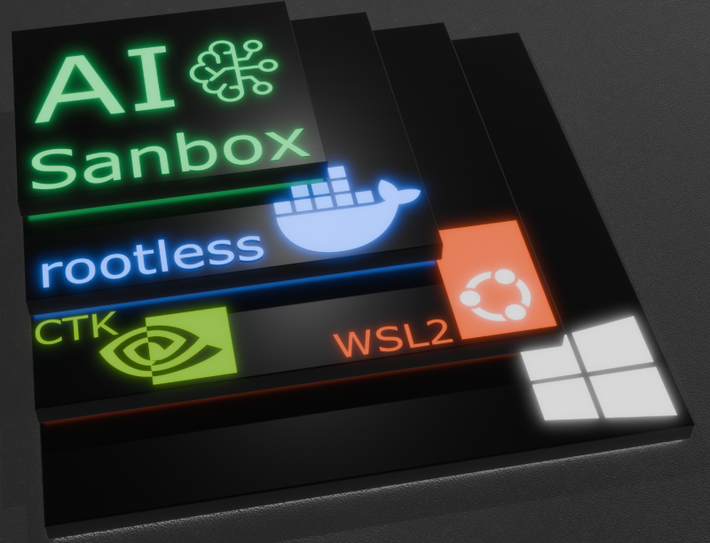
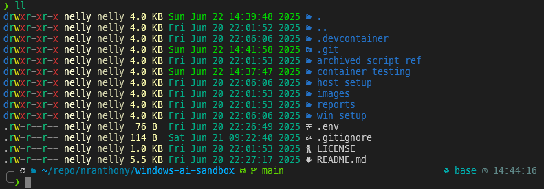

# Custom Windows AI Sandbox


WSL2 Ubuntu 24.04 + rootless Docker + NVIDIA CUDA, organized as a **profile-based sandbox**: one shared hardened image, many per-profile workspaces, Squid-gated egress. Adapted from the sibling [macolima](https://github.com/nranthony/macolima) project.

#### Windows OS &#8594; WSL2 Ubuntu 24.04 LTS &#8594; Rootless Docker &#8594; `windows-ai-sandbox:latest` (one per profile)

---

## Quick Start

The whole daily loop:

```bash
just up <profile>        # start the stack (seeds state, converges skills)
just attach <profile>    # zsh into the container
just verify <profile>    # tier-1 hardening tripwire
just down <profile>      # stop (persistent state survives)
```

`just list` shows every profile. New machine → [Initial Setup](#initial-setup).
After a host reboot → [Full restart](#full-restart).

`just` is the front door and `scripts/profile.sh` is the canonical implementation —
identical in effect, and every recipe is a thin pass-through. `just --list` for the
full set.

---

## Full restart

After a host reboot or `wsl --shutdown`. Rootless Docker is `systemctl --user`
enabled with lingering, so the daemon comes back by itself.

**Before shutting down** — there is no down-all recipe, so stop each profile:

```bash
just list                   # which profiles exist, which are up
just down <profile>         # once per profile that is up
```

**1 · Host is back**

```bash
docker info >/dev/null && echo "rootless daemon OK"   # is the daemon answering?
```

**2 · Is the repo current?** Offline — no docker, no profiles. Run it *before*
bringing anything up, so a failure costs nothing.

```bash
just test-offline           # seven offline suites, then upstream drift
just check-permissions      # manifest proposal vs settings template
```

`test-offline` ends in `tools-check`, which compares `sandbox_templates/VENDORED.lock`
against the channel manifest **and** content-diffs each artifact against the
`source_commit` it claims. Known gap: it cannot see a member repo that *released
without publishing* — that detector lives at the channel root and is not part of this
loop. Only if drift is reported:

```bash
just vendor-tools           # re-consume channel, every hash first
just build                  # ONLY if the wheel moved — it bakes in
```

Skills and plugin trees need no rebuild: they converge from `sandbox_templates/`
on the next `up`.

**3 · Up**

```bash
just up <profile>           # start stack, seed state, converge skills
```

**4 · Settings** — optional; only when the template has moved

Settings seeding is **create-only**: `up` leaves an existing `settings.json` alone
however far the template has moved, and `verify` does not check it. So diff first, and
reset only if the difference matters to you:

```bash
diff sandbox_templates/claude/claude-settings.json \
     ~/.ai-sandbox/profiles/<profile>/claude-home/settings.json   # has it drifted?
just reset-settings <profile>   # overwrite from template, backing up old
```

Reset **discards whatever that profile accumulated locally** and replaces it wholesale:
the per-profile choices Claude Code writes back into the file during a session (model,
effort level) and any permission you widened in-session with "always allow". Reverting
that last one is usually the point. The `.bak.<stamp>` written beside it is the only
undo. Restart `claude` inside the container afterwards — a running session holds the old
rules in memory.

**5 · Verify**

```bash
just verify <profile>       # tier-1 hardening tripwire, per profile
just health                 # agent/proxy/DB up together, every profile
just audit <profile>        # tier-2, 65 probes — after a rebuild
```

**6 · Hygiene** — optional, monthly is about right

```bash
just clean <profile> --deep # prune backups, paste-cache, MCP logs
just docker-gc --dry-run    # report stale containers + build cache
```

`docker-gc` is daemon-wide, not per-profile: re-run it with `--yes` and it removes
stopped containers older than 30d plus excess BuildKit cache. It never touches
`ai-sandbox-*` containers, and only *reports* images and volumes — the two places
durable data can be.

Don't run `clean --deep` between a `reset-settings` and confirming the result — the
backup is the only undo.

**If `up` fails with "network not found"**: a stale DB container is pinned to the
old network. `docker rm -f postgres-<profile>`, then `just up <profile>`.

---

## What's inside

| Layer | Details |
|---|---|
| Base image | NVIDIA CUDA 12.6.3 on Ubuntu 24.04 (digest-pinned) |
| Tools baked in | Claude Code, GitHub CLI (`gh`), GitLab CLI (`glab`), `uv`, zsh + oh-my-zsh + powerlevel10k |
| Runtime hardening | `cap_drop: ALL`, `seccomp=./seccomp.json`, `no-new-privileges`, tmpfs noexec, resource limits (see `docker-compose.yml` / [ARCHITECTURE.md](ARCHITECTURE.md) — compose is the source of truth) |
| Network | `sandbox-internal` (internal:true) + Squid sidecar on `sandbox-external`; allowlist is the only way out |
| User | root-in-container (UID 0) — remaps to host UID 1000 under rootless Docker userns=host |
| GPU | WSL2 hosts only: `docker-compose.wsl-gpu.yml` overlay (`/dev/dxg` + `/usr/lib/wsl` bind + `LD_LIBRARY_PATH`, not `--gpus all`), auto-layered by `profile.sh` when `/dev/dxg` exists. Bare-Linux hosts come up GPU-less on the same base compose |
| Persistent state | `~/.ai-sandbox/profiles/<profile>/` — outlives container recreates |
| Vendored payloads | The `myclickup` CLI (wheel, baked into the image) and the `myconv` skills arrive through one door — the depot channel, via `just vendor-tools`. Every hash is verified before anything is copied, and what was taken is recorded in `sandbox_templates/VENDORED.lock` (tracked; the payloads themselves are gitignored) |

**Not installed, by design** (see `sandbox-hardening-package.md` §7): `bubblewrap`, `socat`, `openssh-client`. These are the tools that would weaponize container escape or VS Code agent-forwarding leaks. See `scripts/verify-sandbox.sh` for the full tripwire.

---

## Initial Setup

### Windows side
1. Copy `win_setup/.wslconfig` → `C:\Users\<UserName>\.wslconfig` (enables Windows firewall integration).
2. Open WSL Ubuntu in a fresh terminal tab (not the one auto-launched by `pwsh` — it has known stdout quirks).

### WSL Ubuntu side
```bash
cd host_setup
./setup-rootless-docker-wsl.sh     # rootless Docker (sudo used internally — read first!)
sudo ./wsl_conf_update.sh          # /etc/wsl.conf
./ohmyzsh-host-setup.sh            # optional: host-side oh-my-zsh
exit                               # then `wsl --shutdown` in Powershell, wait 8s, reopen
```

### VS Code host settings (important — audit Findings A + B)
In Windows VS Code: `Ctrl+Shift+P` → **"Preferences: Open User Settings (JSON)"** (or edit `%APPDATA%\Code\User\settings.json` directly — from WSL that's `/mnt/c/Users/<user>/AppData/Roaming/Code/User/settings.json`). Add:
```jsonc
{
  "remote.SSH.enableAgentForwarding": false,
  "dev.containers.copyGitConfig": false
}
```
These prevent host SSH agent sockets and `~/.gitconfig` (including credential helpers) from leaking into the container. The image also purges `openssh-client` and `init-profile-state.sh` scrubs injected credential helpers on every `up`, as belt-and-braces.

### Repo root `.env`
```bash
GIT_NAME="your-name"
GIT_EMAIL="your-email@example.com"
```
`GIT_NAME`/`GIT_EMAIL` are used by `scripts/setup.sh` to seed git identity. `scripts/profile.sh` always exports its own `PROFILE`/`COMPOSE_PROJECT_NAME` for every compose call, so they are not needed in `.env`.

---

## Profile Workflow

### Bring up a profile
```bash
mkdir -p ~/repo/<profile>       # workspace parent (holds one or more repos)
just up <profile>               # creates state dirs, brings up agent + egress-proxy
just auth <profile>             # claude login — one-time; token persists in ~/.ai-sandbox/
```

### Commands

Profile is the first argument to every per-profile recipe. `build`, `list`,
`health`, `docker-gc` and the repo-level checks take none.

| Recipe | Action |
|---|---|
| `up` / `down` | start / stop the stack (persistent state survives `down`) |
| `attach` | zsh into the agent container — the primary entry point |
| `auth` / `auth-github` / `auth-gitlab` / `auth-antigravity` | interactive logins |
| `logs` / `status` | compose logs / ps |
| `exec <cmd>` | run one command inside the container |
| `recreate` | force-recreate containers (picks up compose/seccomp/proxy/DNS changes) |
| `build` | rebuild the shared image — no profile arg; all profiles pick it up on recreate |
| `rebuild` | build **and** recreate this profile |
| **Verification** | |
| `verify` | tier-1 hardening tripwire (fast, in-container) |
| `audit` [`--clean`] | tier-2 structured audit, 65 probes, JSON to the host |
| `health` | cross-profile: flags a profile whose agent/proxy/DB aren't all up together |
| `deps` [`--osv`] | dependency posture for the profile's workspace (host-side, read-only) |
| **Repo-level** (no profile arg) | |
| `test-offline` | seven offline suites, then `check-upstreams` |
| `vendor-tools` / `tools-check` | consume the depot channel / check the lock against it |
| `check-permissions` | manifest permission proposal vs the settings template (read-only) |
| **State** | |
| `reset-settings` | overwrite claude `settings.json` from the template (backs up the old) |
| `reset-skills` | converge this profile's skills to `sandbox_templates/skills/` |
| `clean` [`--deep`] | prune rotating state (backups, paste-cache, MCP logs) |
| `wipe` / `db-reset` | destructive — read the header first |
| `docker-gc` | host-wide Docker hygiene; report-only for images and volumes |

### `just` and the scripts

`just` needs to be on the WSL host (`sudo apt install just`, or the static binary
from github.com/casey/just). Every recipe is a **thin pass-through** — it never
calls `docker compose` directly, so `scripts/profile.sh`'s `PROFILE` /
`COMPOSE_PROJECT_NAME` exports and the compose `${PROFILE:?}` guard stay in force.
`scripts/profile.sh <profile> <command>` is the canonical form and works
identically if you'd rather skip `just`; onboarding lives in
`just setup <profile> --name "Your Name" --email you@x`.

> Unlike the sibling `macolima` repo, there are **no `colima-*` recipes** (WSL2 *is* the VM), `verify` fronts `profile.sh verify` rather than `setup.sh --verify`, and `build` takes no profile arg. See `docs/sibling-repo-relationship.md`.

### Per-profile state
```
~/.ai-sandbox/profiles/<profile>/
├── claude-home/       # claude sessions, settings, credentials, MCP
├── claude.json        # first-run state, oauthAccount
├── cache/             # npm, uv, pip caches
└── config/            # gh tokens, glab tokens, git config
```

### Inside the container
- `claude`, `gh`, `glab`, `uv`, `python3`, `node` pre-installed.
- `/workspace` = `~/repo/<profile>/` (many repos).
- `/root/.venv` (Python 3.12) — VS Code's default interpreter for smoke tests.
- Claude's `Bash` tool is restricted by `sandbox_templates/claude/claude-settings.json` (pip/uv/git push/curl/ssh denied). The interactive zsh is NOT restricted — install deps yourself during planning, then hand off to the agent.

---

## VS Code

The sandbox is entered via **Attach to Running Container** — VS Code connects to
the container the CLI already brought up. There is no `.devcontainer/` and no
"Reopen in Container" flow: Reopen would drive `docker compose up` itself (needing
`.env` plumbing and bypassing `profile.sh`'s per-profile subnet allocation), and
Attach ignores a repo `devcontainer.json` anyway.

1. Bring the profile up: `just up <profile>`.
2. In VS Code: `Ctrl+Shift+P` → `Dev Containers: Attach to Running Container...` → `ai-sandbox-<profile>`.

All hardening (seccomp, cap_drop, sandbox-internal, DNS sinkhole) lives in
`docker-compose.yml`, so the attached container is fully hardened regardless of
VS Code config.

### Host-side config (the part attach *does* read)

Attach ignores any repo `devcontainer.json`. VS Code instead reads your **host
user `settings.json`** plus a per-container *attached-container configuration*
keyed by image. Configure these once:

**1. Required security settings** — host user `settings.json` (`Ctrl+Shift+P` → *Preferences: Open User Settings (JSON)*):
```jsonc
{
  "remote.SSH.enableAgentForwarding": false,                  // Finding A — SSH agent leak
  "dev.containers.copyGitConfig": false,                      // Finding B — host gitconfig copy
  "dev.containers.gitCredentialHelperConfigLocation": "none"  // Finding C — host credential helper
}
```

**2. Extensions** — host user `settings.json`. `defaultExtensions` installs into *any* attached container:
```jsonc
"dev.containers.defaultExtensions": [
  "ms-python.python",
  "ms-python.vscode-pylance",
  "ms-toolsai.jupyter",
  "ms-python.autopep8",
  "mhutchie.git-graph"
]
```

**3. Port guardrail + interpreter/terminal** — `Ctrl+Shift+P` → *Dev Containers: Open Attached Container Configuration File* (pick the `windows-ai-sandbox` image):
```jsonc
{
  "forwardPorts": [8080, 8501, 8188],
  "settings": {
    "remote.autoForwardPorts": false,
    "python.defaultInterpreterPath": "/root/.venv/bin/python",
    "terminal.integrated.defaultProfile.linux": "zsh"
  }
}
```
`autoForwardPorts: false` matters on Windows — a service binding `0.0.0.0`
otherwise surfaces on Windows localhost without being declared.

See [`docs/vscode-integration-security.md`](docs/vscode-integration-security.md) for the full findings and in-container defenses.

---

## Testing GPU/CUDA
```bash
just exec <profile> bash -lc '
  cd /workspace/windows-ai-sandbox/container_testing && uv sync && \
  uv run python -c "import torch; print(torch.cuda.is_available())"
'
# Expected: True
```
Or inside the attached container: `jupyter notebook container_testing/cuda_test.ipynb` — `CUDA available: True` in the first cell.

---

## Hardening Verification

Two tiers, plus the offline suites that gate changes to the security-sensitive files.

```bash
just verify <profile>     # tier 1 — fast in-container tripwire, ~40 checks
just audit <profile>      # tier 2 — 65 structured probes, JSON written to the host
just test-offline         # the seven regression suites + upstream boundary monitors
```

Tier 1 covers: direct internet blocked, `api.anthropic.com` reachable via the proxy,
`example.com` blocked, `CapEff=0`, `NoNewPrivs=1`, `Seccomp=2`, `bwrap`/`socat`/`ssh`
absent, no leaked `/root/.gitconfig`, no `SSH_AUTH_SOCK`, no `credential.helper`
injection, and the install-quarantine settings. Three `WEAK` results in tier 2 are
expected and documented (AppArmor under rootless Docker on WSL2, the deliberately
open `git` egress block, and the root-writable hook script).

## Image CVE Scan (trivy)
```bash
# On WSL host (see scripts/trivy-scan.sh header for install instructions)
scripts/trivy-scan.sh              # config + secret + image
scripts/trivy-scan.sh image        # CVE scan only
```
Accepted CVEs live in `.trivyignore.yaml`; each has an `expired_at` so it re-surfaces on re-scan.

---

## Troubleshooting

### Permission issues
See [`docs/sandbox-design-notes.md`](docs/sandbox-design-notes.md) — bind-mount ownership and why the container runs as root under rootless Docker (`sudo` is blocked by `no-new-privileges`). CUDA version matching is covered below.

### Common
- **Docker not starting on WSL resume**: `systemctl --user restart docker.service`. D-Bus race is kickstarted from `.zprofile`/`.profile` by the host setup.
- **CUDA version mismatch**: container uses 12.6.3 (driver ≥530.30).
- **VS Code `Exec format error` after Ubuntu upgrade**: `wsl --shutdown` in Powershell, reopen.
- **`code .` from Windows opens rootful Docker**: always launch from inside WSL.

### Uninstall rootless Docker
```bash
/usr/bin/dockerd-rootless-setuptool.sh uninstall -f
/usr/bin/rootlesskit rm -rf "$HOME/.local/share/docker"
```

---

## Docker Security Audit

Docker Bench results under `./reports/docker-bench-security-report.md`. Many rootful-Docker findings don't apply here (rootless daemon, user-namespaced); feedback on further hardening welcome.
```bash
git clone https://github.com/docker/docker-bench-security.git
cd docker-bench-security && ./docker-bench-security.sh
```

---

## Resources
- WSL config: https://learn.microsoft.com/en-us/windows/wsl/wsl-config
- CUDA on WSL: https://docs.nvidia.com/cuda/wsl-user-guide/
- Container breakout reading: https://unit42.paloaltonetworks.com/container-escape-techniques


