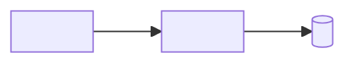

# Architecture

<!--
  STARTING POINT to adapt. Keep this file lean — it is the agent's mental map,
  not full documentation. One diagram plus the boundaries an agent must not
  cross. If it sprawls, move detail into docs/ and link from AGENTS.md.
-->

<One paragraph: what the system is and the 2–4 top-level parts it splits into.>

## System map

<Replace with the real shape — components and the arrows between them. A text
tree or ASCII diagram works too; the medium doesn't matter, the boundaries do.>

## Boundaries

- <Part A> talks to <Part B> only via <interface> — never <the shortcut>.
- <Generated/vendored paths> are never hand-edited.
- <Data that must not leave its store / secrets handling / tenancy rule.>

## Where responsibilities live

| Area | Home | Notes |
|---|---|---|
| <capability> | `<path/>` | <one-line rule of thumb> |
